# Z3hr0_CTF_2020

<p align="center">
  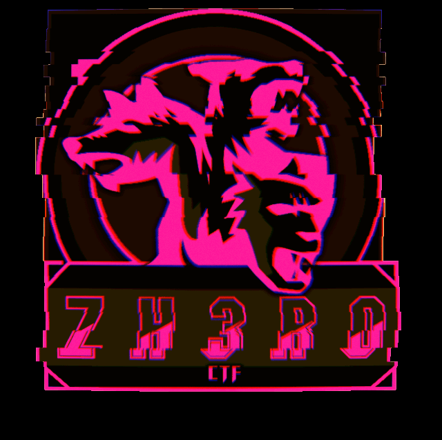
</p>

***
# Table of Contents

* [Forensics](#Forensics)
  - [LSB fun](#LSB-fun)
  - [Snow](#Snow)
  - [is it a troll???](#is it a troll???)
 
* [Crypto](#Crypto)
  - [RSA-Warmup](#RSA-Warmup)
  - [Mix](#Mix)
* [Web](#Web)
  - [Web-Warmup](#Web-Warmup)

***


# Forensics
  
## LSB fun
  
have you ever heard of LSB :) ?

Author : h4x5p4c3

file : [user.zip](Assets//Files/user.zip)

**Solution:**
 
After you unzip the file you'll get a jpg image, the first thing came to my mind is to use [jsteg](https://github.com/lukechampine/jsteg)
```bash
jsteg reveal chall.jpg
```

and Bingo! 
**flag:**```zh3r0{j5t3g_i5_c00l}```

## Snow
I wonder if the snow loves the trees and fields, that it kisses them so gently?

Author : h4x5p4c3 

file : [snow.zip](Assets//Files/snow.zip)

**Solution:**
I unzipped the file and got some hidden files , so I tried firstly to check ```flag.txt``` but it wasn't the correct flag

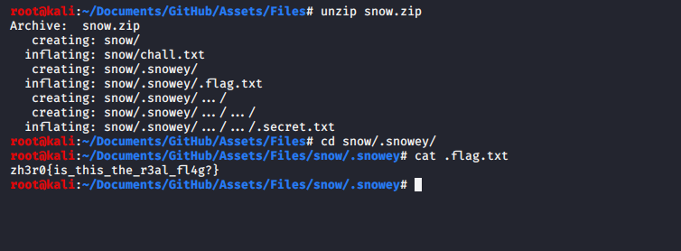

 so I kept checking all the hidden files and folders until I got : ```welc0me_to_zh3r0_ctf```
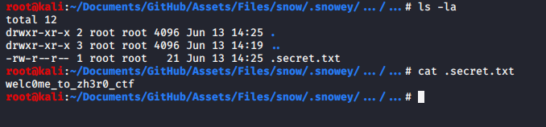

which is also not the flag, so I went back to the unhidden files ```chall.txt``` , from the name of the challenge we can guess that we should use [stegsnow](https://0x00sec.org/t/steganography-concealing-messages-in-text-files/500) or [snow](http://www.darkside.com.au/snow/)

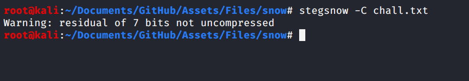

This indicates that we need a password , I tried ```john``` using ```rockyou.txt``` but I got nothing, so I remembered the string ```welc0me_to_zh3r0_ctf``` that I got from ```.secret.txt```   

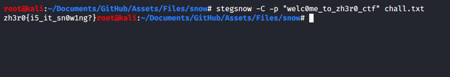

**flag:**```zh3r0{i5_it_sn0w1ng?}```


## is it a troll???
there is baby key and baby hide the key somewhere. Can you help his father to find the key??

Author : cryptonic007

file : [Trollface.jpg](Assets//Files/Trollface.jpg)

**Solution:**

At the beginning I tried ```strings```,```binwalk``` etc.. But nothing interesting, so I tried ```exiftool```

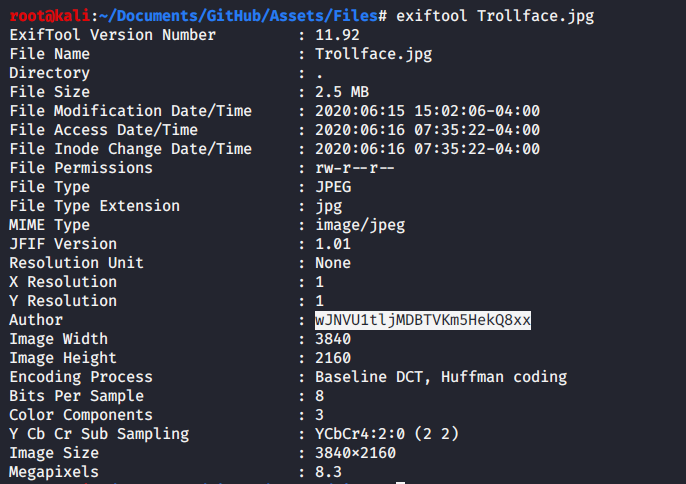

There's a text at Author looks encrypted by ```Base64``` ,but that wasn't true so I tried ```Base58``` and ```Base62``` using [CyberChef](https://gchq.github.io/CyberChef/) and ```Base62``` worked.

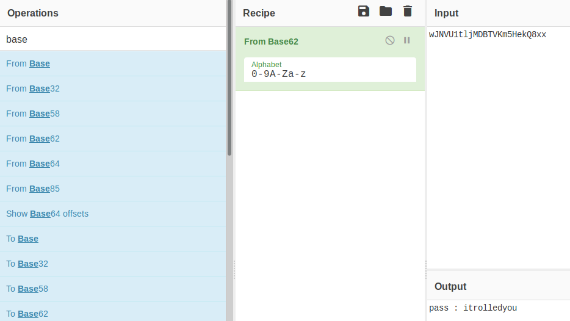

I got ```pass : itrolledyou``` ,so since it mentioned password I used [steghide](http://steghide.sourceforge.net/) tool with ```itrolledyou``` as a password

```
steghide extract -sf Trollface.jpg 
```
It extracted a zip file that contains another image

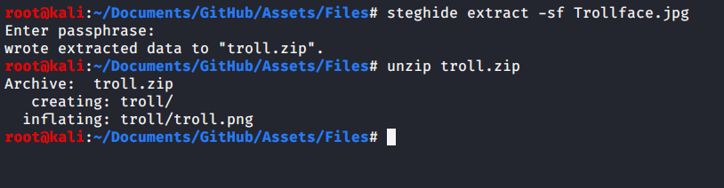

I tried usual things such as ```strings, exiftool etc..``` but again nothing interesting , then I used [zsteg](https://github.com/zed-0xff/zsteg) which is a great tool for ```.png``` and ```.bmp```. I got a strange text again that looks encrypted

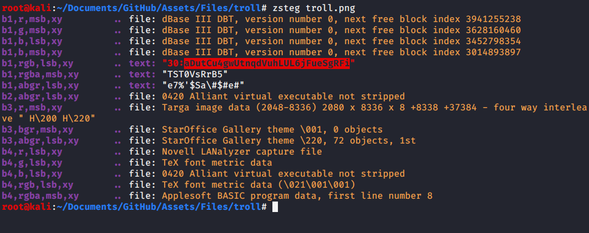


So again using [CyberChef](https://gchq.github.io/CyberChef/) I tried all Bases and ```Base58``` worked.


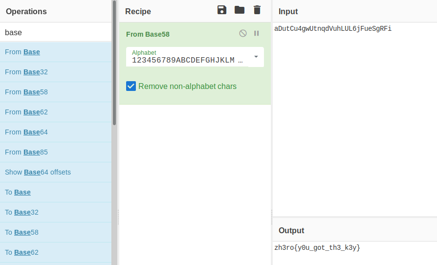


**flag:**```zh3ro{y0u_got_th3_k3y}```


# Crypto

## RSA-Warmup
RSA is one of the first public-key cryptosystems and is widely used for secure data transmission. In such a cryptosystem, the encryption key is public and distinct from the decryption key which is kept secret.
You all know this :p
here is a warmup question.

nc crypto.zh3r0.ml 8451

Author : Finch

**Solution:**

After connecting we will get :
```
N:423130325547287702818575275911638514089000677312397089081805057991969030705298706721977584791771140221048428491277072574621931762053228292827558133848431392100907341475739701625443407159362865290713505269417296254943824301579820381205337075166450305894211548942250717365528936705397266131955244020850392151721662069939
e 65537
CT: 64355745797365388490412995076301513621958191046794834306956838312585280589421173619216473785642127494178580195654010801071081452854241462208557812725513288017128104994318837129257203983692773852306990540483172991569629801482576680150381602438163038587331616025889766347178216490112604297980040248921138616716362273714
```
Firstly we need to factorize ```N``` by using [Integer factorization calculator](https://www.alpertron.com.ar/ECM.HTM)

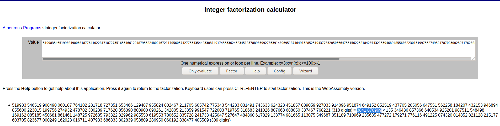

We can choose eaither the highlighted value or the one after ```x``` , then we need to remove all whitespaces from that value we choosed I use this website [Delete All Whitespace Characters](https://www.browserling.com/tools/remove-all-whitespace) 


Then you can use any RSA tool but I prefer this one that I got from a write-up video on YouTube [BabyRSADecryption.py](https://www.youtube.com/watch?v=dKt0x-UhPeY)

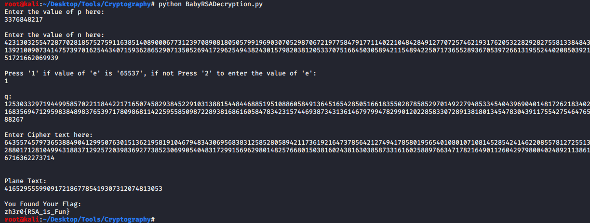

**flag:**```zh3r0{RSA_1s_Fun}``` 

## Mix

At the `BASE`ment no. `65536`,
A man is irritated with 
`SHIFT` key in his `KEYBOARD` 
as it's a sticky key, 
A kid is having chocolate 
icecream with a `SPOON`.

Author : Whit3_D3vi1

File : [Mix.zip](Assets//Files/Mix.zip)

**Solution:**

> Fast of all , the challenge description has everything you need to find out the flag.

At first when I unzip the `Mix.zip` archived file I got two new file under the Mix folder

1. [flag.txt](Assets//Files/Mix/flag.txt)

file data: 

```
	If you opened this then you are a n00b 
```


2. [chall_encrypted.txt](Assets//Files/Mix/chall_encrypted.txt)

file data :

```
ꍦ鱡映㸺ꅙ饯𒀠啤啳𓁬𐙵𓅰魴餠𒁪𖥧𔐠遯𓁪𖥴顲啹𓁪𓁴𒀠啤𒅵啩灧鵳𖠠楪扴詽鸭餫𓉩怴㸊ꍦ鱡朠㸺攳攳昳昳攳昳攳攳攲攳昳昳昳攳攳昳攳攲攳攳昳昳攳攳昳昳攲攳昳攳昳昳昳昳昳攲攳攳昳昳攳昳攳攳攲攳昳昳昳攳昳昳昳攲攳攳昳昳攳攳昳昳攲攳昳昳昳攳攳昳昳攲攳攳昳昳攳攳攳攳攲攳昳昳攳昳昳攳昳攲攳攳昳昳攳攳昳昳攲攳昳攳昳昳昳昳昳攲攳昳昳昳攳昳昳昳攲攳昳昳攳昳攳攳昳攲攳攳昳昳攳昳昳昳攲攳昳昳攳昳攳攳攳㸊ꍦ鱡栠㸺襍𖡅襍𖡅襍𖡅襍𔕁襍𔕁祍𔕅襍𖡁祍𖡅襍𖡁祍𖡅襍𖡅襍𔕅襍𖡁襍𖡅襍𖡅襍𖡅祍𖡅祍𖡅祍𖡅祍𖡅祍𔕁祍𖡁襍𖡁祍𖡁祍𖡁祍𖡁祍𔕁祍𔕁祍𔕁祍𔕁祍𔕁祍𔕁襍𖡁祍𖡁襍𔕁祍𔕁祍𔕁祍𔕁祍𔕁祍𔕁祍𔕁祍𔕁祍𔕁祍𔕁祍𔕁祍𔕁祍𔕁祍𔕁祍𔕁祍𔕁祍𔕁祍𔕁祍𔕁襍𖡁祍𔕁祍𔕁祍𔕁祍𔕁襍𖡁祍𔕁襍𖡁祍𖡁祍𔕁襍𖡁祍𖡁襍𖡅襍𖡅襍𔕁襍𖡁祍𖡁祍𖡅襍𖡅襍𖡅襍𔕁襍𖡁祍𖡁襍𔕁祍𔕁祍𔕁祍𔕁祍𔕁襍𖡁祍𖡁祍𔕁祍𔕁祍𔕁祍𔕁祍𔕁祍𔕁祍𔕁祍𔕁祍𔕁祍𔕁襍𖡁祍𖡅襍𖡅襍𖡅襍𖡅襍𖡅襍𖡅襍𖡅祍𖡁祍𔕅祍𔕁祍𔕁祍𔕁祍𔕁祍𔕁祍𔕁祍𔕁祍𔕁祍𖡁祍𔕅祍𔕁祍𔕁祍𖡁祍𔕅祍𖡅祍𔕁祍𔕁祍𖡁祍𔕅祍𖡁祍𔕅襍𖡅襍𔕁襍𖡁祍𖡁祍𖡅襍𖡅襍𖡅襍𖡅襍𖡅襍𖡅襍𖡅祍𖡁祍𔕅祍𖡅祍𖡅祍𖡅襍𖡅襍𖡅襍𖡅襍𔕁襍𖡁癍爽ᔊ
```

The `flag.txt` file contents are not so interesting so we have move forward to the `chall_encrypted.txt` file.
At first, when I saw the the content of the file I thought that I have to translate that shitty thing.
For this I goes to [google translate](https://translate.google.co.in/) but it couldn't find anything (except some gibberish).
After this I returned back to the main site & read the challenge description properly.
At this time I saw there are some words which are highlited into bold.
After seeing the first highlited word I have got a question in my mind that is the cipher text is any type of base encrypted data.
To find out the answer I just searched on google for the first two highlited words together & I found that the encrypted data is 
a [base65536](https://www.better-converter.com/Encoders-Decoders/Base65536-Decode) hash encrypted text.
After decoding that file data I got this :

```

flag 1:
Yjod od s lrunpstf djogy vo[jrtyrcy jrtr od upi g;sh xj4t-}U-i+dit4+

flag 2:
3030313130313030203031313130303130203030313130303131203031303131313131203030313130313030203031313130313131203030313130303131203031313130303131203030313130303030203031313031313031203030313130303131203031303131313131203031313130313131203031313031303031203030313130313131203031313031303030

flag 3:
MTExMTExMTExMTAwMTAwMDEwMTAxMDExMTAxMDExMTExMTEwMTAxMTExMTExMTExMDExMDExMDExMDExMDAwMDAxMTAxMDAxMDAxMDAxMDAwMDAwMDAwMDAwMDAwMDAwMTAxMDAxMTAwMDAwMDAwMDAwMDAwMDAwMDAwMDAwMDAwMDAwMDAwMDAwMDAwMDAwMDAwMDAwMDAwMDAwMDAwMTAxMDAwMDAwMDAwMDAwMTAxMDAwMTAxMDAxMDAwMTAxMDAxMTExMTExMTAwMTAxMDAxMDExMTExMTExMTAwMTAxMDAxMTAwMDAwMDAwMDAwMDAwMTAxMDAxMDAwMDAwMDAwMDAwMDAwMDAwMDAwMDAwMDAwMDAwMTAxMDExMTExMTExMTExMTExMTExMTExMDAxMDEwMDAwMDAwMDAwMDAwMDAwMDAwMDAwMDAwMDAxMDEwMDAwMDAwMDAxMDEwMDExMDAwMDAwMDAxMDEwMDAxMDEwMTExMTAwMTAxMDAxMDExMTExMTExMTExMTExMTExMTExMDAxMDEwMDExMDExMDExMTExMTExMTExMTAwMTAxMA==

```

These are the main three parts of the flag.
The first one is [Shift Keyboard](https://www.dcode.fr/keyboard-shift-cipher) encrypted data as the next highlited word from the challenge description says.
After decoding this I got the first part of the flag.

```
zh3r0{Y0u_sur3_

```

The middle one is looks like some decimal number presentation of the middle part of the flag.
But I am wrong. When I was googling for this I got [this artical](https://www.reddit.com/r/codes/comments/evz1uk/riddle_from_discord_coding_language_if_you_could/) that have this following text.

```
Hex ascii codes. 20 = Space, 30 = 0, 31 = 1.

```

There after, first I have turned the [hex into ascii](https://www.rapidtables.com/convert/number/hex-to-ascii.html) format & I got some binaries. After that I turned the [binary to text](https://www.rapidtables.com/convert/number/binary-to-ascii.html) format.
And yup I got the middle part of the flag.

```
4r3_4w3s0m3_wi7h

```

The third one is [base64](https://www.base64decode.net/) encoded data. After decoding this I got another cipher text which looks like some 
binary data but that is a [Spoon](https://www.dcode.fr/spoon-language) cipher as the last highlited word from the challenge description says
& yeah I got the last part of the flag as well.

```
_411_7h3_ski115}

```

**flag:**```zh3r0{Y0u_sur3_4r3_4w3s0m3_wi7h_411_7h3_ski115}```


# Web
## Web-Warmup

Chall Link : http://web.zh3r0.ml:8080/

Easy peasy.

Author : careless_finch
 
 **Solution**
 
 Firstly we check the page source 
 
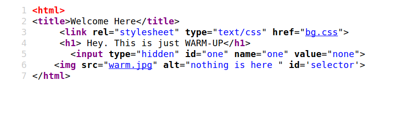 


As there's nothing interesting , let's check ```bg.css```


 

**flag:** ```zh3r0{y3s_th1s_1s_w4rmup}```
