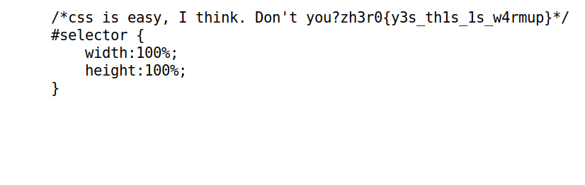

# Z3hr0_CTF_2020

<p align="center">
  
</p>

***
# Table of Contents

* [Forensics](#Forensics)
  - [LSB fun](#LSB-fun)
  - [Snow](#Snow)
  - [is it a troll???](#is-it-a-troll???)
 
* [Crypto](#Crypto)
  - [RSA-Warmup](#RSA-Warmup)
***
* [Web](#Web)
  - [Web-Warmup](#Web-Warmup)

# Forensics
  
## LSB fun
  
have you ever heard of LSB :) ?

Author : h4x5p4c3

file : [user.zip](Assets//Files/user.zip)

**Solution:**
 
After you unzip the file you'll get a jpg image, the first thing came to my mind is to use [jsteg](https://github.com/lukechampine/jsteg)
```bash
jsteg reveal chall.jpg
```

and Bingo! 
**flag:**```zh3r0{j5t3g_i5_c00l}```

## Snow
I wonder if the snow loves the trees and fields, that it kisses them so gently?

Author : h4x5p4c3 

file : [snow.zip](Assets//Files/snow.zip)

**Solution:**
I unzipped the file and got some hidden files , so I tried firstly to check ```flag.txt``` but it wasn't the correct flag


 so I kept checking all the hidden files and folders until I got : ```welc0me_to_zh3r0_ctf```


which is also not the flag, so I went back to the unhidden files ```chall.txt``` , from the name of the challenge we can guess that we should use [stegsnow](https://0x00sec.org/t/steganography-concealing-messages-in-text-files/500) or [snow](http://www.darkside.com.au/snow/)


This indicates that we need a password , I tried ```john``` using ```rockyou.txt``` but I got nothing, so I remembered the string ```welc0me_to_zh3r0_ctf``` that I got from ```.secret.txt``` which was  


**flag:**```zh3r0{i5_it_sn0w1ng?}```


## is it a troll???
there is baby key and baby hide the key somewhere. Can you help his father to find the key??

Author : cryptonic007

file : [Trollface.jpg](Assets//Files/Trollface.jpg)

**Solution:**

At the beginning I tried ```strings```,```binwalk``` etc.. But nothing interesting, so I tried ```exiftool```


There's a text at Author looks encrypted by ```Base64``` ,but that wasn't true so I tried ```Base58``` and ```Base62``` using [CyberChef](https://gchq.github.io/CyberChef/) and ```Base62``` worked.


I got ```pass : itrolledyou``` ,so since it mentioned password I used [steghide](http://steghide.sourceforge.net/) tool with ```itrolledyou``` as a password

```
steghide extract -sf Trollface.jpg 
```
It extracted a zip file that contains another image


I tried usual things such as ```strings, exiftool etc..``` but again nothing interesting , then I used [zsteg](https://github.com/zed-0xff/zsteg) which is a great tool for ```.png``` and ```.bmp```. I got a strange text again that looks encrypted


So again using [CyberChef](https://gchq.github.io/CyberChef/) I tried all Bases and ```Base58``` worked.


**flag:**```zh3ro{y0u_got_th3_k3y}```


# Crypto

## RSA-Warmup
RSA is one of the first public-key cryptosystems and is widely used for secure data transmission. In such a cryptosystem, the encryption key is public and distinct from the decryption key which is kept secret.
You all know this :p
here is a warmup question.

nc crypto.zh3r0.ml 8451

Author : Finch

**Solution:**

After connecting we will get :
```
N:423130325547287702818575275911638514089000677312397089081805057991969030705298706721977584791771140221048428491277072574621931762053228292827558133848431392100907341475739701625443407159362865290713505269417296254943824301579820381205337075166450305894211548942250717365528936705397266131955244020850392151721662069939
e 65537
CT: 64355745797365388490412995076301513621958191046794834306956838312585280589421173619216473785642127494178580195654010801071081452854241462208557812725513288017128104994318837129257203983692773852306990540483172991569629801482576680150381602438163038587331616025889766347178216490112604297980040248921138616716362273714
```
Firstly we need to factorize ```N``` by using [Integer factorization calculator](https://www.alpertron.com.ar/ECM.HTM)


We can choose eaither the highlighted value or the one after ```x``` , then we need to remove all whitespaces from that value we choosed I use this website [Delete All Whitespace Characters](https://www.browserling.com/tools/remove-all-whitespace) 


Then you can use any RSA tool but I prefer this one that I got from a write-up video on YouTube [BabyRSADecryption.py](https://www.youtube.com/watch?v=dKt0x-UhPeY)


**flag:**```zh3r0{RSA_1s_Fun}``` 


# Web
## Web-Warmup

Chall Link : http://web.zh3r0.ml:8080/

Easy peasy.

Author : careless_finch
 
 **Solution""
 
 Firstly we check the page source 
 
 


As there's nothing interesting , let's check ```bg.css```


 

**flag:** ```zh3r0{y3s_th1s_1s_w4rmup}```
