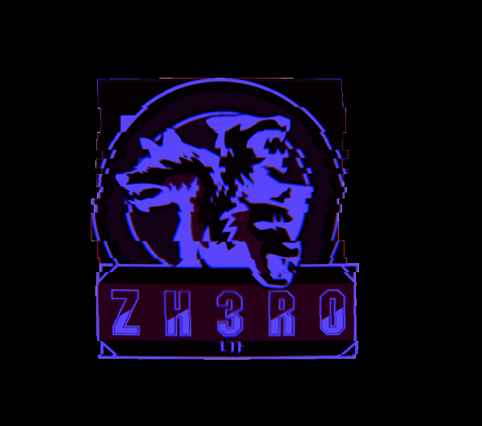

# Z3hr0_CTF_2020

<p align="center">
  
</p>

***
# Table of Contents

* [Forensics](#Forensics)
  - [LSB fun](#LSB-fun)
  - [Snow](#Snow)
  - [is it a troll???](#is-it-a-troll???)
  
***
 
# Forensics
  
## LSB fun
  
have you ever heard of LSB :) ?

Author : h4x5p4c3

file : [user.zip](Assets//Files/user.zip)

**Solution:**
 
After you unzip the file you'll get a jpg image, the first thing comes to my mind is to use [jsteg](https://github.com/lukechampine/jsteg)
```bash
jsteg reveal chall.jpg
```

and Bingo! 
**flag:**```zh3r0{j5t3g_i5_c00l}```

## Snow
I wonder if the snow loves the trees and fields, that it kisses them so gently?

Author : h4x5p4c3 

file : [snow.zip](Assets//Files/snow.zip)

**Solution:**
I unzipped the file and got some hidden files i tried firstly to check ```flag.txt``` and it wasn't the correct flag


 so I kept checking all hidden files and folders until i got : ```welc0me_to_zh3r0_ctf```


 Which is also not the flag, so i went back to the unhidden files ```chall.txt``` , from the name of the challenge we can guess that we should use [stegsnow](https://0x00sec.org/t/steganography-concealing-messages-in-text-files/500) or [snow](http://www.darkside.com.au/snow/)


This indiactes that we need a password , I tried ```john``` using ```rockyou.txt``` but i got nothing, so I remembered the string that I got from ```.secret.txt``` which was ```welc0me_to_zh3r0_ctf``` 


**flag:**```zh3r0{i5_it_sn0w1ng?}```


## is it a troll???
there is baby key and baby hide the key somewhere. Can you help his father to find the key??

Author : cryptonic007

file : [Trollface.jpg](Assets//Files/Trollface.jpg)

At the beginning I tried ```strings```,```binwalk``` etc.. But nothing interested, so I tried ```exiftool```


There's a text at Author looks encrypted by ```Base64``` ,but that's not true so I tried ```Base58``` and ```Base62``` using [CyberChef](https://gchq.github.io/CyberChef/) and ```Base62``` worked.


I got ```pass : itrolledyou``` ,so since it mentioned password I used ```steghide``` tool with ```itrolledyou``` as a password

```bash
steghide extract -sf Trollface.jpg 
```
It extracted a zip file that contains another image

 which is a great tool for ```png``` and ```bmp```. I got a strange text again that looks encrypted


So again using [CyberChef](https://gchq.github.io/CyberChef/) I tried all Bases and ```Base58``` worked.


**flag:**```zh3ro{y0u_got_th3_k3y}```


